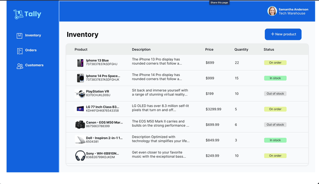
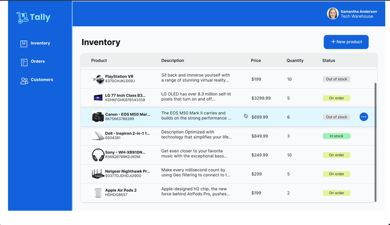
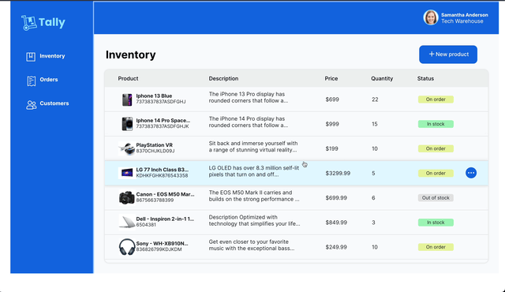
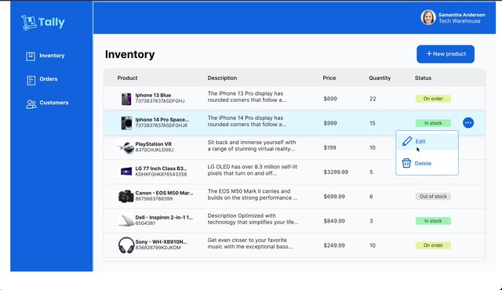
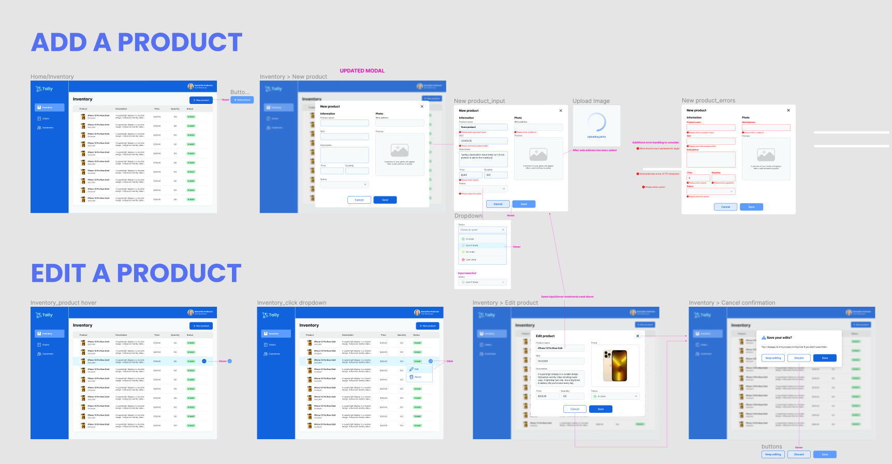
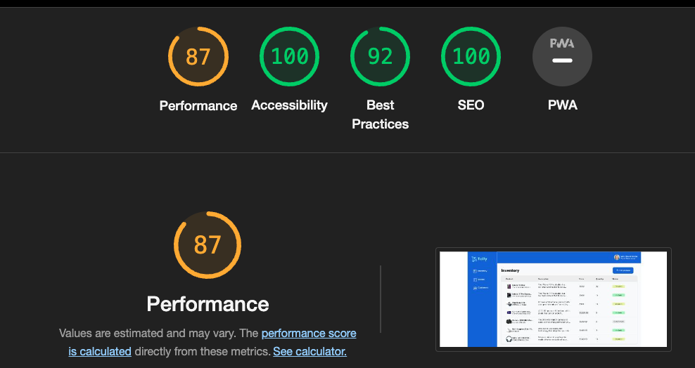

  

 
  <h1 align="center">Tally</h1>
  

   A desktop CRUD inventory tracking application
   
  

 

   
   

 

<!-- Add your project demo gif here -->
  <h4 align="center">Demo</h4>
   
  

    
  

   
  

    
  

   
  

    
  

   
  

    
  

   
  

    
  

   

  

 

<h3 align="center">Tally - Inventory Tracker</h3>
 

## 🧐About

Tally is an app that helps you keep track of your inventory! With its CRUD (create, read, update, delete) functionality, you can easily manage your inventory. The front end is built with React, React Hook Form, and React Select. To simulate the back end, I used JSON server. This app is currently only designed for desktops. I think a mobile redesign would be best for presenting the inventory information in a more user-friendly way.

 

## 💡Features

- Easily manage your products with the ability to view, add, update and delete
- View and add specific product details
- Several modals guide users and provide clear confirmation when making changes
- Minimal re-renders and better performance brought to you by React Hook Form
- Visually pleasing a accessible select dropdown menus using React Select

 

## ⛏️Built with

- JavaScript
- HTML
- CSS
- React
- Git VCS
- Github
- React-Hook-Form
- React-Select
- React-Spinners
- React Testing Library
- Jest
- Figma

## 🏁Getting Started

1. Clone this repository
2. Open two terminal windows
3. `cd` into the project directory in one window
4. run `npm install` - in the project directory
5. run `npm start` - to start up the Front-end
6. `cd` into the project directory in the second terminal window
7. run `npm run server`- to start the development server
8. The app should be running on `http://localhost:3000/`in your browser
    

## 🗓Planning and challenges

I opted for an inventory tracking application since this would be a perfect fit for a CRUD application. My first step was to hunt online for inspiration and research features for inventory tracking applications. The Figma-designed application was my guide for design and feature implementation. Although I made a few tweaks, I stuck to the design layout as much as possible.

It was my first experience using React Hook Form. React Hook Form is a form library that reduces form component re-renders allowing components to mount faster than traditionally controlled components. It's also highly customizable and integrates well with other libraries. After reading through the documentation, watching videos, as well as other online resources, I was able to implement this form library along with React Select.

Throughout my project, I encountered several obstacles. I ran into form control flow issues, accessibility problems and code readability. As the code base grew, it became harder to understand. To improve the project, I consolidated separate modal components into one. I refactored some portions of the code base to achive the desired outcome with conditional rendering instead of creating additional application states. I also broke down components into smaller reusable pieces. My inexperience posed visual design challenges, but every new project is a learning opportunity. With the valuable experience gained from this project, I'll take these lessons with me to the next one.

 

### Continued development

 

I'm not currently planning any additions to this project. However, I am looking to make some improvements to the existing functionality. At the moment, the MainSectionContent.js component has quite a few state setters. I could streamline things and make it more efficient with useReducer instead of useState.

 

## 🔧Mock up, planning tools and scores

 

  <h2>Tally comp</h2>

  <h2>Lighthouse scores</h2>

## 🎉Acknowledgement

- [React](https://react.dev/)
- [React Hook Form](https://react-hook-form.com/)
- [React-Select](https://react-select.com/home)
- [React Spinners](https://www.npmjs.com/package/react-spinners)

> \_**NOTE:** All product images were sourced via random image search. I claim no ownership and use these images only for development practice.
